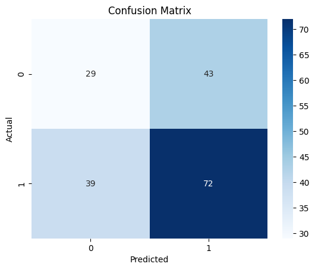
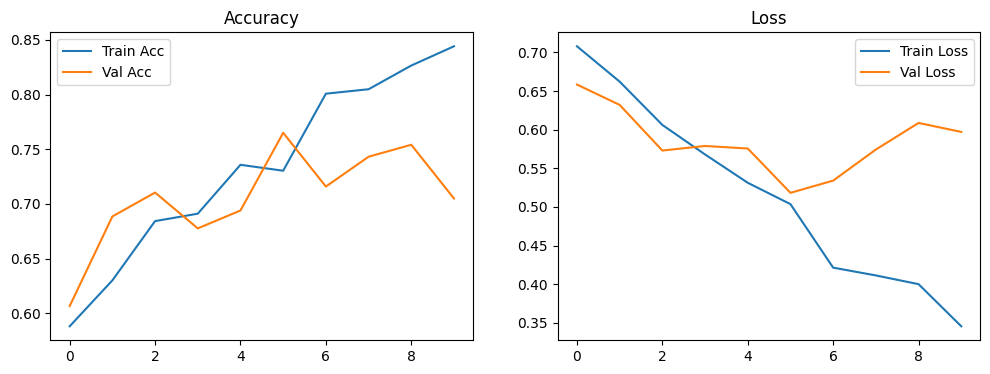

## **2️⃣ Deep Learning Variant – Project Report**

---

### **Project Title**

**Human Detection using Deep Learning (Convolutional Neural Networks)**

---

### **Aim**

To build a deep learning model that can automatically detect humans in images using convolutional neural networks (CNNs) without manual feature engineering.

---

### **Why this project?**

1. **Higher accuracy** – Learns directly from raw pixels.
2. **Scalable** – Works well on large datasets.
3. **Automation** – No need to manually extract features.

---

### **Dataset Used**

* **Name:** Human Detection Dataset (`constantinwerner/human-detection-dataset`)
* **Structure:** Same as ML version.
* **Size:** Same as ML version.

---

### **Proposed Methodology**

1. **Data Preparation**

   * Load and resize images to 128×128 pixels.
   * Normalize pixel values to range \[0,1].
   * Augment data (rotation, flipping, zoom) to avoid overfitting.

   *(..\human detection dataset\0\1.png)*

2. **Model Architecture**

   * CNN with:

     * Convolution layers (feature extraction)
     * MaxPooling layers (downsampling)
     * Dropout layers (reduce overfitting)
     * Fully Connected layers (classification)
   * Output layer with **sigmoid** activation for binary classification.

 

3. **Model Training**

   * Loss Function: Binary Cross-Entropy.
   * Optimizer: Adam.
   * Epochs: 20–30 depending on results.
   * Batch Size: 32 or 64.

4. **Evaluation**

   * Confusion Matrix, Precision, Recall, F1-Score.
   * ROC-AUC curve.

   *](../Output/d2.png)*
  

5. **Prediction**

   * Test on unseen images and visualize.

    *](../Output/d1.png)*

---

### **Libraries Used**

* **TensorFlow / Keras** – Deep learning model building
* **OpenCV** – Image handling
* **matplotlib, seaborn** – Visualization
* **numpy** – Numerical operations

---

### **Algorithms Used**

* CNN (Custom or Pre-trained like MobileNetV2 for transfer learning)

---

### **Technologies & Tools**

* Python 3.x
* Jupyter Notebook / VS Code
* GPU-enabled environment (Google Colab / Kaggle)

---

### **Conclusion**

**The CNN-based deep learning approach significantly outperforms traditional ML methods in complex scenarios. However, it requires more computation power and training time.**
---
